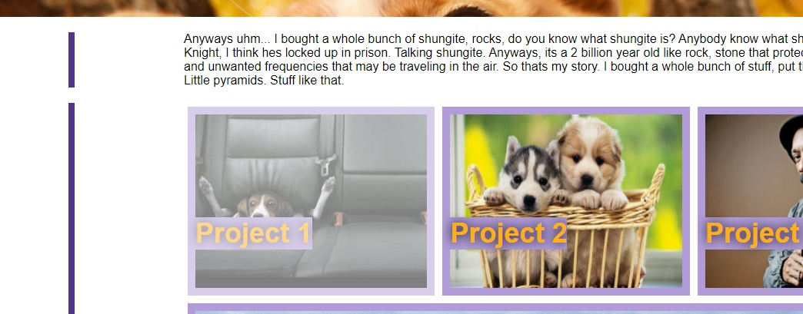
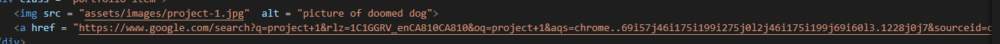
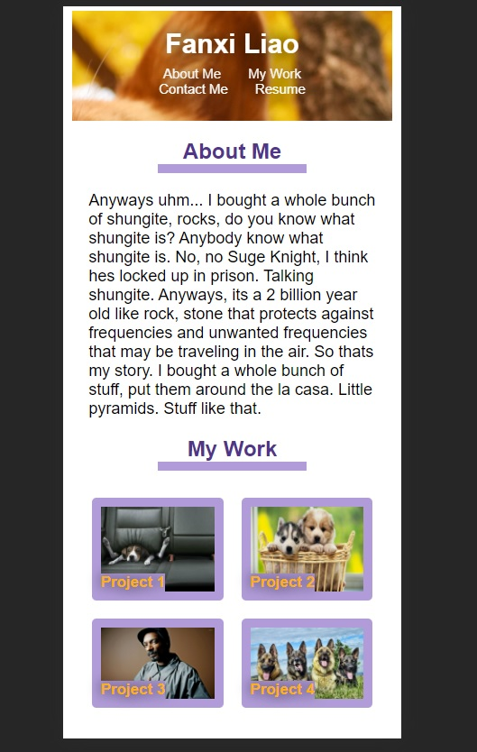

# 02 Advanced CSS: Portfolio

This week I've created a portfolio type webpage as a place to host my future projects. The website design is responsive.

Because I don't have many projects to showcase at the moment, most of the links on the webpage are placeholders to random google searches or youtube car reviews.

## Screeshots

 

 

 

### Resources used

Google Images
 
[Wallpaper Acess](https://wallpaperaccess.com/)
 
[w3schools](https://www.w3schools.com/default.asp)
 
